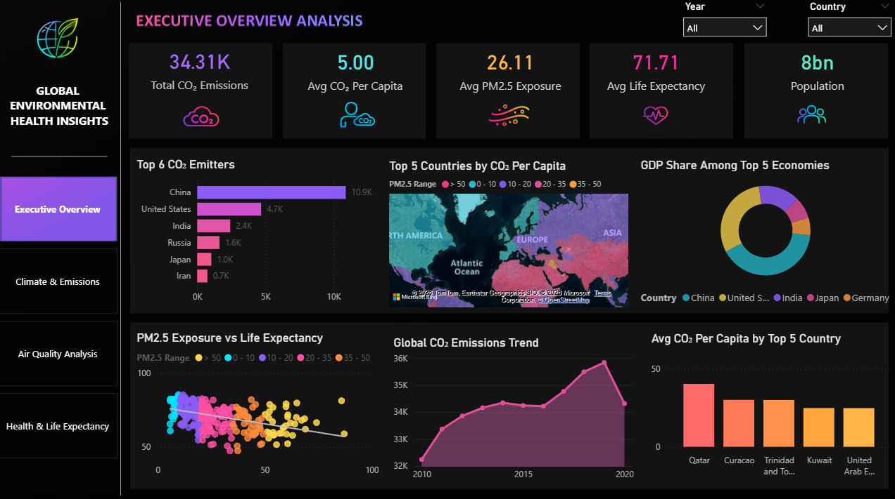
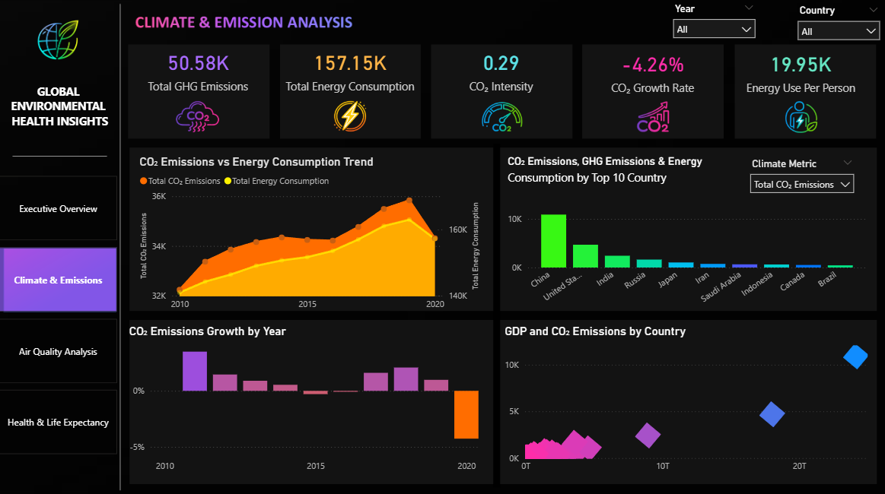
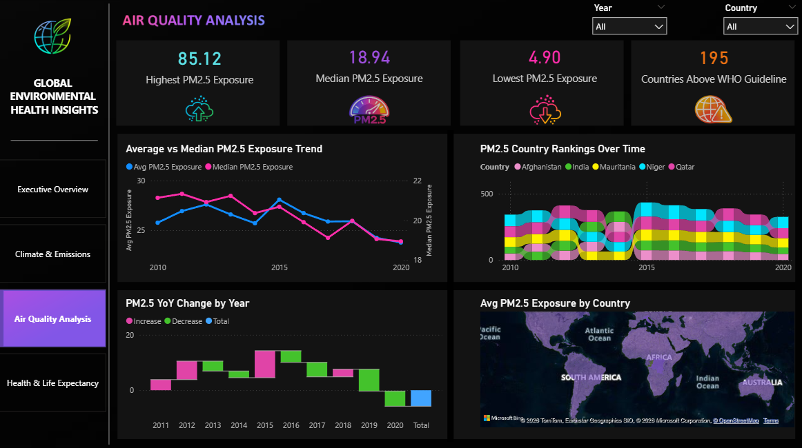
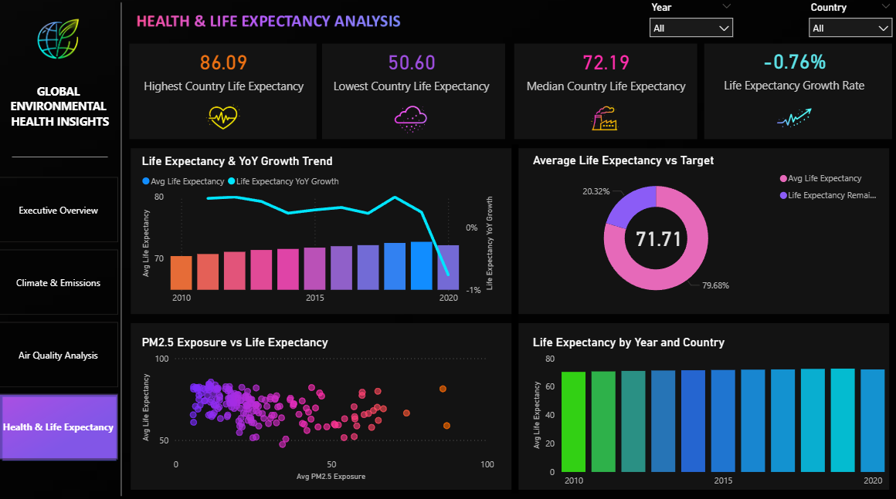
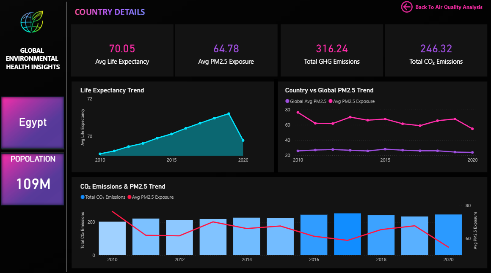

# Project Overview

Global Environmental Health Insights is an interactive Power BI dashboard designed to analyze environmental, climate, and public health indicators across countries from 2010–2020.
The dashboard combines multiple datasets to uncover relationships between carbon emissions, greenhouse gases, energy consumption, air pollution (PM2.5), GDP, population, and life expectancy. It enables users to monitor environmental performance, compare countries, and identify trends through dynamic and interactive visualizations.

# Objectives

- Analyze global CO₂ emissions and greenhouse gas trends.
- Monitor PM2.5 air pollution across countries.
- Compare life expectancy with environmental indicators.
- Evaluate energy consumption and CO₂ intensity.
- Identify the world's largest emitters.
- Provide country-level drill-through analysis.
- Support data-driven environmental decision making.

# Dashboard Pages

## 1️⃣ Executive Overview
Provides a high-level summary of global environmental health.
### KPIs
- Total CO₂ Emissions
- Average CO₂ per Capita
- Average PM2.5 Exposure
- Average Life Expectancy
- Total Population
### Visuals
- Top 6 CO₂ Emitters
- Global PM2.5 Map
- GDP Share of Top Economies
- PM2.5 vs Life Expectancy
- CO₂ Emission Trend
- Average CO₂ per Capita

## 2️⃣ Climate & Emission Analysis
Focuses on climate-related indicators and energy consumption.
### KPIs
- Total Greenhouse Gas Emissions
- Total Energy Consumption
- CO₂ Intensity
- CO₂ Growth Rate
- Energy Use Per Person
### Visuals
- CO₂ vs Energy Consumption Trend
- Top 10 Emitting Countries
- CO₂ Growth by Year
- GDP vs CO₂ Emissions

## 3️⃣ Air Quality Analysis
Examines global PM2.5 pollution.
### KPIs
- Highest PM2.5 Exposure
- Median PM2.5 Exposure
- Lowest PM2.5 Exposure
- Countries Above WHO Guideline
### Visuals
- Average vs Median PM2.5 Trend
- Country Rankings
- PM2.5 Year-over-Year Change
- Global PM2.5 Map

## 4️⃣ Health & Life Expectancy Analysis
Analyzes life expectancy and health indicators.
### KPIs
- Highest Life Expectancy
- Lowest Life Expectancy
- Median Life Expectancy
- Life Expectancy Growth Rate
### Visuals
- Life Expectancy Trend
- Average Life Expectancy vs Target
- PM2.5 vs Life Expectancy
- Life Expectancy by Year

## 5️⃣ Country Drill-through Dashboard
Interactive page allowing detailed analysis of individual countries.
### Includes
- Average Life Expectancy
- PM2.5 Exposure
- CO₂ Emissions
- Greenhouse Gas Emissions
- Population
- Historical Trends

# 📷 Dashboard Preview

## Executive Overview

## Climate & Emissions

## Air Quality Analysis

## Health & Life Expectancy

## Country Drill-through

#  Key Insights
- China is the largest contributor to global CO₂ emissions.
- Higher PM2.5 exposure is generally associated with lower life expectancy.
- Energy consumption closely follows global emission trends.
- Developed economies contribute significantly to global GDP while exhibiting varying emission levels.
- Air quality has shown gradual improvements in several regions, while others remain above WHO guideline levels.

#  Tools & Technologies
- Microsoft Power BI
- Power Query
- DAX
- Data Modeling
- Excel / CSV
- Bing Maps
- Data Visualization

#  Skills Demonstrated
- Data Cleaning
- Data Transformation
- Data Modeling
- DAX Calculations
- KPI Design
- Dashboard Development
- Interactive Reporting
- Business Intelligence
